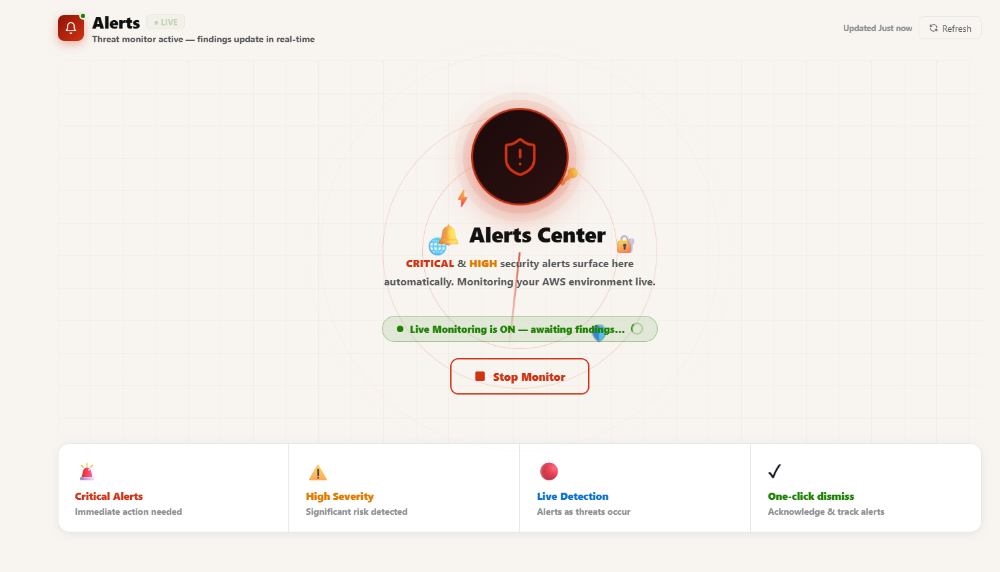

<div align="center">


# 🛡️ AWS CloudShield

**Enterprise-grade AWS security scanner, threat monitor & auto-remediation platform**

[](https://python.org)
[](https://fastapi.tiangolo.com)
[](https://react.dev)
[](https://electronjs.org)
[](https://aws.amazon.com)
[](https://sqlite.org)
[](LICENSE)

*Scan · Detect · Remediate · Monitor — all from one beautiful desktop panel*

[⬇️ Download Installer](https://github.com/NSudeep-Rust/AWS-Cloud-Control-Panel/releases/latest) &nbsp;·&nbsp; [📖 Docs](#-getting-started) &nbsp;·&nbsp; [🐛 Issues](https://github.com/NSudeep-Rust/AWS-Cloud-Control-Panel/issues)

</div>

---

## 📸 Screenshots

### Welcome & Account Selection

> Clean onboarding experience — add multiple AWS accounts (Root or IAM), choose region, and launch your first scan in seconds

### Command Center — Overview

> Real-time risk score gauge, severity breakdown, recent findings summary, and live scan radar — all at a glance

### Security Scanner

> Full scan results across 52+ checks — filter by severity (CRITICAL / HIGH / MEDIUM / LOW), module, and region. Each finding shows the affected resource, fix suggestion, and auto-fix availability

### Threat Monitor — Live Analysis

> Continuously monitors your AWS environment for new and resolved threats. Displays all analyzed findings with severity tags, auto-fix availability, and one-click remediation routing. Start the monitor for real-time WebSocket-based alerting

### Auto-Remediation Pipeline

> Four-stage pipeline: **Detect** findings → **Plan** the fix (dry-run preview) → **Execute** changes on AWS → **Fixed** and tracked. Every action is logged with full rollback support

### Rollback & Restore Points

> Every executed remediation creates a restore point. One-click **Recover** to undo any fix — whether it's detaching an IAM policy, removing an S3 ACL, or re-enabling a security group rule. No permanent lock-in

### Audit History

> Full timeline of every scan and remediation event. Filter by scan-only or remediation-only events, search by finding type or resource ID, and toggle to reveal the locked finding snapshot per scan

### Security Analytics

> Risk score over time, severity distribution, remediation rate, regional heatmap, top finding types, and compliance scorecards across **CIS AWS Benchmark**, **PCI DSS**, and **NIST CSF** — all live-updated after every scan

### Live Alerts Monitor

> Real-time alert feed for current session findings. Filters by severity, sortable by time — automatically surfaces new CRITICAL and HIGH findings the moment a scan completes. Desktop toast notifications on Windows

---

## ✨ Features

### 🔍 Security Scanner
- **52+ security checks** across IAM, S3, EC2, VPC, RDS, KMS, CloudTrail, CloudWatch, and more
- **9 AWS regions** scanned concurrently with parallel per-region sub-scanners
- Fully parallelized S3 (per-bucket) and IAM (per-user) checks for **~20–30s scan time**
- Real-time progress log with elapsed time and module-specific status messages
- Findings ranked by severity: `CRITICAL` → `HIGH` → `MEDIUM` → `LOW`

### 🛡️ Threat Monitor
- Real-time continuous monitoring mode (WebSocket-based live polling)
- Filterable by module, severity, and remediation type (AUTO-FIX / MANUAL)
- **195+ threats analyzed** with auto-fix routing to the Remediation engine
- Windows desktop toast notifications with CloudShield branding

### ⚡ Auto-Remediation Engine
- **Dry-run preview** before any change is applied to AWS
- One-click apply with danger guard for irreversible actions
- Auto-loads fixable findings directly from the latest scan
- **Rollback** support — revert any executed fix from the Rollback section

### 🔄 Rollback & Restore Points
- Every executed fix automatically creates a timestamped restore point
- One-click **Recover** per restore point — undo any change safely
- Tracks: IAM policy detach, S3 ACL removal, VPC flow logs, security group restrictions, KMS key rotation
- Permanent changes are tracked separately with clear warnings

### 📜 Audit History
- Full audit timeline of every scan and remediation event
- Filter by: All Events, Scans Only, Remediations Only
- Per-scan finding snapshots with locked counts — tap to reveal
- Scheduled scan support (cron-based automation toggle)

### 📊 Security Analytics
- **Risk Score gauge** (0–100) with live trend chart across all scans
- Severity breakdown, per-scan stacked bar charts, top finding types
- **Regional heatmap** showing finding density per AWS region
- **Compliance Scorecard** — CIS AWS Benchmark, PCI DSS, NIST CSF pass/fail per rule
- Remediation rate tracking (detected vs. fixed vs. still active)

### 🔔 Live Alerts
- Real-time alert feed for the current session
- Filters by severity (CRITICAL / HIGH / MEDIUM / LOW)
- Automatic Windows toast notifications for new critical findings
- Per-session isolation — clears on new scan start

### 🔐 Multi-Account Support
- Add unlimited AWS accounts (Root or IAM user credentials)
- Switch accounts without re-entering credentials
- Per-account scan isolation and history

---

## 🏗️ Architecture

```
┌─────────────────────────────────────────────────────────┐
│              Electron Desktop Shell (Windows)            │
│   Wraps React frontend · IPC bridge · Native notifs      │
└───────────────────────┬─────────────────────────────────┘
                        │
┌───────────────────────▼─────────────────────────────────┐
│                  React / Vite Frontend                    │
│  WelcomePage → PanelPage (Overview, Scanner, Threats,    │
│  Remediation, Rollback, History, Analytics, Alerts)      │
│  ScanContext · AuthContext · ToastSystem · Sidebar        │
└───────────────────────┬─────────────────────────────────┘
                        │ REST API + WebSocket
┌───────────────────────▼─────────────────────────────────┐
│              FastAPI Backend (port 8000)                  │
│  /api/scan  /api/execute  /api/rollback  /api/alerts     │
│  /api/history  /api/accounts  /api/analytics             │
└───┬───────────────┬───────────────┬─────────────────────┘
    │               │               │
┌───▼───┐     ┌─────▼────┐   ┌─────▼──────────────────┐
│Scanner│     │Remediation│   │   Threat Monitor        │
│Engine │     │ Executor  │   │   (FastWatcher/Polling) │
│9 mods │     │ Planner   │   │   WebSocket broadcaster │
└───┬───┘     │ Rollback  │   └────────────────────────┘
    │         └─────┬─────┘
┌───▼─────────────▼──────────────────────────────────────┐
│         boto3 / botocore  (AWS SDK)                      │
│         SQLite  (findings, executions, accounts, history)│
└─────────────────────────────────────────────────────────┘
```

---

## 🔬 Security Modules

| Module | Checks | Key Findings Detected |
|--------|--------|-----------------------|
| **IAM** | 12 | Admin users, wildcard policies, MFA missing, unused keys, key rotation |
| **S3** | 5 | Public ACLs, encryption disabled, versioning off, public access block |
| **EC2** | 6 | IMDSv2 disabled, public IPs, default SGs, termination protection |
| **VPC** | 5 | Flow logs disabled, default VPC, internet gateway, public subnets |
| **Security Groups** | 4 | Open SSH/RDP, unrestricted ingress, unused groups, NACL misconfig |
| **CloudTrail** | 3 | Logging disabled, no encryption, S3 bucket exposed |
| **CloudWatch** | 2 | Log group retention, metric filters |
| **KMS** | 2 | Key rotation disabled, CMK exposure |
| **RDS** | 3 | Public access, deletion protection, backup disabled |

---

## 🚀 Getting Started

### Option A — Windows Installer (Recommended)

1. [Download `CloudShield-Setup-v1.0.0.exe`](https://github.com/NSudeep-Rust/AWS-Cloud-Control-Panel/releases/latest)
2. Run the installer
3. Launch **AWS CloudShield** from your desktop
4. Add your AWS credentials → Run Scan

### Option B — Run from Source

#### Prerequisites

| Requirement | Version |
|-------------|---------|
| Python | 3.11+ |
| Node.js | 18+ |
| AWS Account | Root or IAM credentials |

```bash
# 1. Clone the repository
git clone https://github.com/NSudeep-Rust/AWS-Cloud-Control-Panel.git
cd AWS-Cloud-Control-Panel

# 2. Create and activate Python virtual environment
python -m venv venv
venv\Scripts\activate        # Windows

# 3. Install Python dependencies
pip install -r requirements.txt

# 4. Start the backend API
python -m uvicorn app.api.main:app --host 127.0.0.1 --port 8000 --reload

# 5. In a new terminal — start the frontend
cd app/ui
npm install
npm run dev
```

Open **http://localhost:5173** in your browser.

---

## 📁 Project Structure

```
CloudSecurityPanel/
├── app/
│   ├── api/
│   │   ├── main.py              # FastAPI app entry
│   │   └── routes/              # All API endpoints
│   ├── core/
│   │   └── aws_session.py       # boto3 session manager
│   ├── modules/
│   │   ├── scanner/             # 9 scanner engines
│   │   ├── remediation/
│   │   │   ├── executor.py      # Applies fixes to AWS
│   │   │   ├── planner.py       # Dry-run preview
│   │   │   └── rollback.py      # Reverts executed fixes
│   │   └── threat_monitor/      # Live monitoring engine
│   ├── database/
│   │   └── models.py            # SQLAlchemy ORM models
│   └── ui/src/
│       ├── pages/sections/      # All panel sections
│       ├── context/             # AuthContext, ScanContext
│       └── components/          # Sidebar, ToastSystem
├── electron/                    # Electron desktop shell
├── updater/                     # Auto-updater (GitHub Releases)
├── installer/                   # Inno Setup installer config
├── run_b10.bat                  # Full production build script
└── requirements.txt
```

---

## 🛠️ Tech Stack

| Layer | Technology |
|-------|-----------|
| **Desktop Shell** | Electron 28 |
| **Backend** | FastAPI (Python 3.11) |
| **AWS SDK** | boto3 + botocore |
| **Database** | SQLite via SQLAlchemy |
| **Frontend** | React 18 + Vite 5 |
| **Styling** | Vanilla CSS (dark/light mode) |
| **Real-time** | WebSocket (FastAPI) |
| **Notifications** | Electron IPC → Windows Toast |
| **Build** | PyInstaller + Inno Setup |
| **Updates** | GitHub Releases + auto-updater |

---

## 🤝 Contributing

This project is currently in active development. Issues and feature requests welcome via [GitHub Issues](https://github.com/NSudeep-Rust/AWS-Cloud-Control-Panel/issues).

---

## 📄 License

MIT License — see [LICENSE](LICENSE) for details.

---

<div align="center">
Built with ❤️ for AWS security professionals<br/>
<strong>AWS CloudShield</strong> — Scan. Detect. Remediate.
</div>
