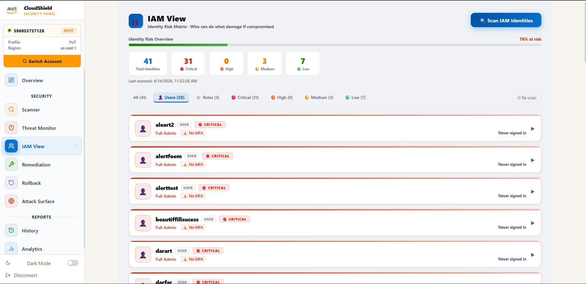
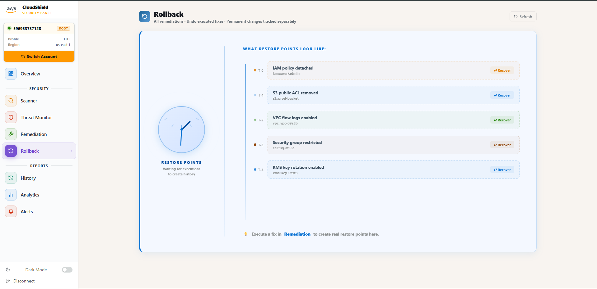
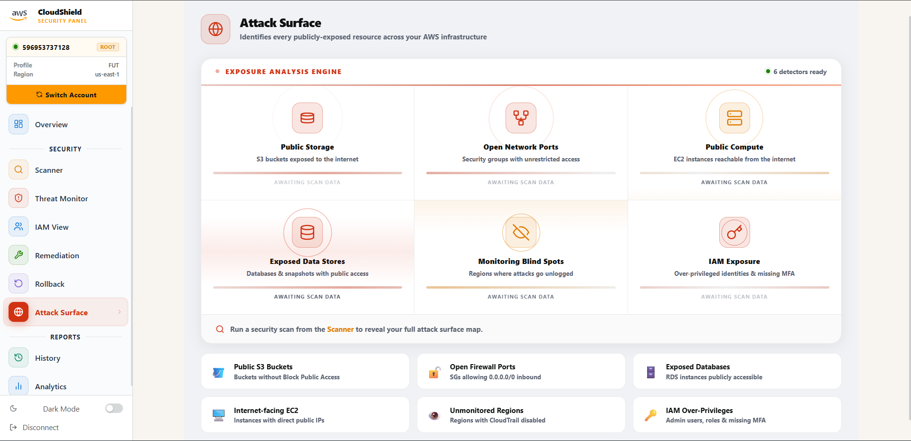
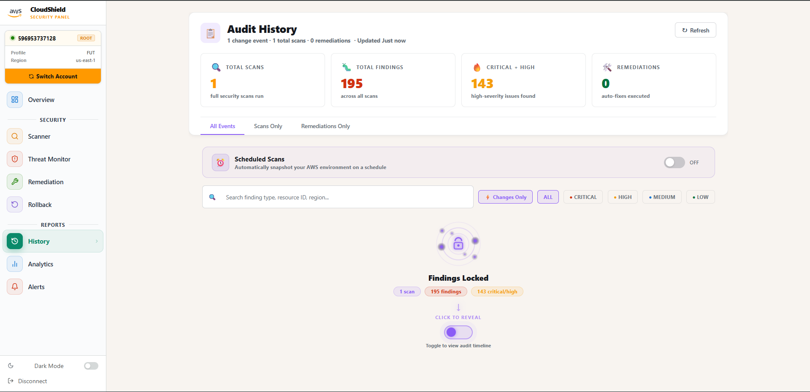
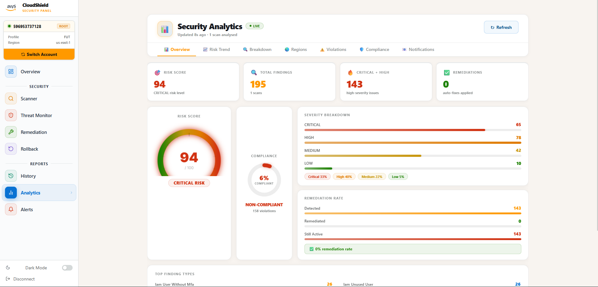

<div align="center">


# 🛡️ AWS CloudShield

**Enterprise-grade AWS security scanner, threat monitor, auto-remediation & identity risk platform**

[](https://python.org)
[](https://fastapi.tiangolo.com)
[](https://react.dev)
[](https://electronjs.org)
[](https://aws.amazon.com)
[](https://sqlite.org)
[](LICENSE)

*Scan · Detect · Remediate · Monitor · Analyse — all from one beautiful desktop panel*

[⬇️ Download Installer](https://github.com/NSudeep-Rust/AWS-Cloud-Control-Panel/releases/latest) &nbsp;·&nbsp; [📖 Docs](#-getting-started) &nbsp;·&nbsp; [🐛 Issues](https://github.com/NSudeep-Rust/AWS-Cloud-Control-Panel/issues)

</div>

---

## 📸 Screenshots

### Welcome & Account Selection

> Clean onboarding experience — add multiple AWS accounts (Root or IAM), choose region, and launch your first scan in seconds

### Command Center — Overview

> Real-time risk score gauge, severity breakdown, recent findings summary, and live scan radar — all at a glance. Quick Actions panel gives one-click access to every section

### Security Scanner

> Full scan results across 52+ checks — filter by severity (CRITICAL / HIGH / MEDIUM / LOW), module, and region. Each finding shows the affected resource, fix suggestion, and auto-fix availability

### Threat Monitor — Live Analysis

> Continuously monitors your AWS environment for new and resolved threats. Displays all analysed findings with severity tags, auto-fix availability, and one-click remediation routing. Start the monitor for real-time WebSocket-based alerting

### IAM View — Identity Risk Matrix

> Like **Parental Controls for AWS** — scan every IAM user and role and instantly see their blast-radius risk score (CRITICAL / HIGH / MEDIUM / LOW). Reveals which identities have Full Admin access, which have no MFA, who can assume what roles, and what the damage would be if each identity were compromised. Independent one-click scan, no dependency on the main scanner

### Auto-Remediation Pipeline

> Four-stage pipeline: **Detect** findings → **Plan** the fix (dry-run preview) → **Execute** changes on AWS → **Fixed** and tracked. Every action is logged with full rollback support

### Rollback & Restore Points

> Every executed remediation creates a restore point. One-click **Recover** to undo any fix — whether it's detaching an IAM policy, removing an S3 ACL, or re-enabling a security group rule. No permanent lock-in

### Attack Surface — Exposure Map

> Visual map of everything publicly exposed in your AWS account — open security group ports, public S3 buckets, publicly accessible EC2 and RDS instances. Aggregated across all regions in a single view that AWS Console never provides

### Audit History

> Full timeline of every scan and remediation event. Filter by scan-only or remediation-only events, search by finding type or resource ID, and toggle to reveal the locked finding snapshot per scan

### Security Analytics

> Risk score over time, severity distribution, remediation rate, regional heatmap, top finding types, and compliance scorecards across **CIS AWS Benchmark**, **PCI DSS**, and **NIST CSF** — all live-updated after every scan


---

## ⚡ Features

### 🔍 Security Scanner
- **52+ security checks** across IAM, S3, EC2, VPC, RDS, KMS, CloudTrail, CloudWatch, and more
- **9 AWS regions** scanned concurrently with parallel per-region sub-scanners
- Fully parallelised S3 (per-bucket, per-region clients) and IAM (bulk fetch) checks for **~40s full scan time**
- Real-time progress log with elapsed time and module-specific status messages
- Findings ranked by severity: `CRITICAL` → `HIGH` → `MEDIUM` → `LOW`

### 👥 IAM View — Identity Risk Matrix *(New)*
- Independent IAM-only scanner — no dependency on the full scan pipeline
- Uses `get_account_authorization_details` for a **single-call bulk fetch** of all users, roles, and policies
- **Blast-radius scoring**: CRITICAL / HIGH / MEDIUM / LOW per identity
- Shows what each user/role can actually DO — Full Admin, Power User, Read/Write, Read Only
- MFA status per user, group memberships, trust principals per role
- Expandable cards with "If compromised" impact warnings for high-risk identities
- Filter by: All · Users · Roles · Critical · High · Medium · Low
- Typical scan time: **2–5 seconds** (vs 12–20s with naive per-identity calls)

### 🛡️ Threat Monitor
- Real-time continuous monitoring mode (WebSocket-based live polling)
- Filterable by module, severity, and remediation type (AUTO-FIX / MANUAL)
- **195+ threats analysed** with auto-fix routing to the Remediation engine
- Windows desktop toast notifications with CloudShield branding

### 🌐 Attack Surface — Exposure Map *(New)*
- Aggregates all publicly exposed AWS resources in **one view across all regions**
- Detects: open security group ports (SSH/RDP/HTTP/HTTPS/custom), public S3 buckets, public EC2, public RDS instances
- Shows exposure type, resource ID, region, and risk severity per resource
- AWS Console requires switching regions one-by-one — this shows everything instantly

### 🔧 Auto-Remediation Engine
- **Dry-run planning** mode: preview exactly what will change before touching AWS
- **Safe execution**: applies targeted fixes (close port, block S3 public access, rotate key, etc.)
- Rollback snapshots created for every executed fix
- Full audit trail of every action with timestamps and user context

### ↩️ Rollback & Restore Points
- One-click revert for any previously executed remediation
- Stores pre-fix state as a JSON snapshot in SQLite
- Rollback covers: IAM policy detachment, S3 ACL changes, security group rule removal

### 📊 Security Analytics
- Risk score trend line over time
- Severity distribution pie/bar charts
- Remediation success rate tracking
- Top finding types frequency chart
- Compliance scorecard: CIS AWS Benchmark · PCI DSS · NIST CSF

### 📋 Audit History
- Immutable log of every scan and remediation event
- Finding snapshot preserved per scan (rollback-safe even if AWS state changes)
- Full-text search across findings and resource IDs


---

## 🗂️ Security Modules

| Module | Checks | Key Findings Detected |
|--------|--------|-----------------------|
| **IAM** | 12 | Admin users, wildcard policies, MFA missing, unused keys, key rotation |
| **S3** | 5 | Public ACLs, encryption disabled, versioning off, public access block |
| **EC2** | 6 | IMDSv2 disabled, public IPs, default SGs, termination protection |
| **VPC** | 5 | Flow logs disabled, default VPC, internet gateway, public subnets |
| **Security Groups** | 4 | Open SSH/RDP, unrestricted ingress, unused groups, NACL misconfig |
| **CloudTrail** | 3 | Logging disabled, no encryption, S3 bucket exposed |
| **CloudWatch** | 2 | Log group retention, metric filters |
| **KMS** | 2 | Key rotation disabled, CMK exposure |
| **RDS** | 3 | Public access, deletion protection, backup disabled |
| **IAM View** | — | Blast-radius risk per identity, MFA gaps, over-privileged roles |
| **Attack Surface** | — | Public SGs, public S3, public compute, exposed endpoints |

---

## 🚀 Getting Started

### Option A — Windows Installer (Recommended)

1. [Download `CloudShield-Setup-v1.0.0.exe`](https://github.com/NSudeep-Rust/AWS-Cloud-Control-Panel/releases/latest)
2. Run the installer
3. Launch **AWS CloudShield** from your desktop
4. Add your AWS credentials → Run Scan

### Option B — Run from Source

#### Prerequisites

| Requirement | Version |
|-------------|---------|
| Python | 3.11+ |
| Node.js | 18+ |
| AWS Account | Root or IAM credentials |

```bash
# 1. Clone the repository
git clone https://github.com/NSudeep-Rust/AWS-Cloud-Control-Panel.git
cd AWS-Cloud-Control-Panel

# 2. Create and activate Python virtual environment
python -m venv venv
venv\Scripts\activate        # Windows

# 3. Install Python dependencies
pip install -r requirements.txt

# 4. Start the backend API
python -m uvicorn app.api.main:app --host 127.0.0.1 --port 8000 --reload

# 5. In a new terminal — start the frontend
cd app/ui
npm install
npm run dev
```

Open **http://localhost:5173** in your browser.

---

## 📁 Project Structure

```
CloudSecurityPanel/
├── app/
│   ├── api/
│   │   ├── main.py              # FastAPI app entry
│   │   └── routes/              # All API endpoints
│   ├── core/
│   │   └── aws_session.py       # boto3 session manager
│   ├── modules/
│   │   ├── scanner/             # 9 scanner engines (IAM, S3, EC2, VPC…)
│   │   ├── iam_view/            # Independent IAM identity risk scanner
│   │   ├── remediation/
│   │   │   ├── executor.py      # Applies fixes to AWS
│   │   │   ├── planner.py       # Dry-run preview
│   │   │   └── rollback.py      # Reverts executed fixes
│   │   └── threat_monitor/      # Live monitoring engine
│   ├── database/
│   │   └── models.py            # SQLAlchemy ORM models
│   └── ui/src/
│       ├── pages/sections/      # Overview, Scanner, Threats, IAMView,
│       │                        # Remediation, Rollback, AttackSurface,
│       │                        # History, Analytics
│       ├── context/             # AuthContext, ScanContext
│       └── components/          # Sidebar, ToastSystem
├── electron/                    # Electron desktop shell
├── updater/                     # Auto-updater (GitHub Releases)
├── installer/                   # Inno Setup installer config
├── docs/screenshots/            # README screenshots
├── run_b10.bat                  # Full production build script
└── requirements.txt
```

---

## 🔧 Architecture

```
┌────────────────────────────────────────────────────────────┐
│              Electron Desktop Shell                        │
│   Wraps React frontend · IPC bridge · Native notifs       │
└────────────────────────┬───────────────────────────────────┘
                         │
┌────────────────────────▼───────────────────────────────────┐
│                  React / Vite Frontend                     │
│  WelcomePage · PanelPage                                   │
│  Sections: Overview · Scanner · Threat Monitor ·           │
│            IAM View · Remediation · Rollback ·             │
│            Attack Surface · History · Analytics            │
│  ScanContext · AuthContext · ToastSystem · Sidebar         │
└────────────────────────┬───────────────────────────────────┘
                         │  REST API + WebSocket
┌────────────────────────▼───────────────────────────────────┐
│              FastAPI Backend (port 8000)                   │
│  /api/scan   /api/execute   /api/rollback   /api/schedule  │
│  /api/history   /api/accounts   /api/analytics             │
│  /api/attack-surface   /api/iam-view                      │
└────────┬──────────────┬──────────────────┬─────────────────┘
         │              │                  │
    ┌────▼────┐   ┌─────▼──────┐   ┌──────▼──────────────┐
    │Scanner  │   │Remediation │   │  Threat Monitor     │
    │Engine   │   │ Executor   │   │  (Polling engine)   │
    │9 mods   │   │ Planner    │   │  WebSocket broadcaster│
    └────┬────┘   │ Rollback   │   └─────────────────────┘
         │        └────────────┘
    ┌────▼──────────────────────────────────────────────────┐
    │         boto3 / botocore  (AWS SDK)                   │
    │  IAM View Scanner · Attack Surface · All Modules      │
    │         SQLite  (findings, executions, accounts)      │
    └───────────────────────────────────────────────────────┘
```

---

## 🔌 Tech Stack

| Layer | Technology |
|-------|-----------|
| **Desktop Shell** | Electron 28 |
| **Backend** | FastAPI (Python 3.11) |
| **AWS SDK** | boto3 + botocore |
| **Database** | SQLite via SQLAlchemy |
| **Frontend** | React 18 + Vite 5 |
| **Styling** | Vanilla CSS (dark/light mode) |
| **Real-time** | WebSocket (FastAPI) |
| **Notifications** | Electron IPC + Windows Toast |
| **Build** | PyInstaller + Inno Setup |
| **Updates** | GitHub Releases + auto-updater |

---

## 🤝 Contributing

This project is currently in active development. Issues and feature requests welcome via [GitHub Issues](https://github.com/NSudeep-Rust/AWS-Cloud-Control-Panel/issues).

---

## 📄 License

Proprietary — Copyright (c) 2025 Sudeep. All rights reserved. See [LICENSE](LICENSE) for details.

---

<div align="center">
Built with ❤️ for AWS security professionals<br/>
<strong>AWS CloudShield</strong> — Scan. Detect. Remediate.
</div>
