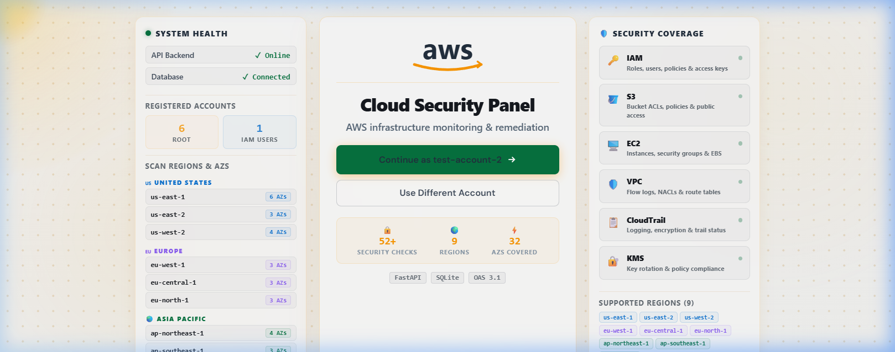
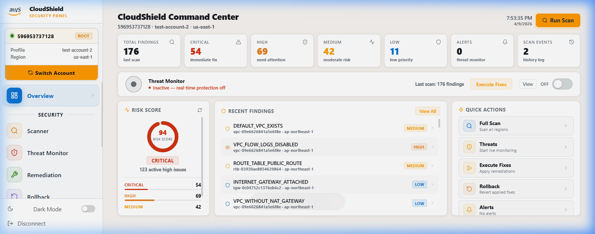
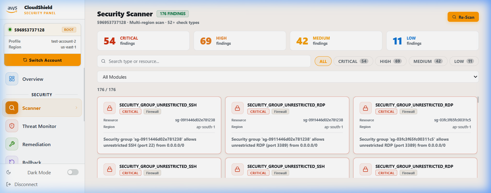
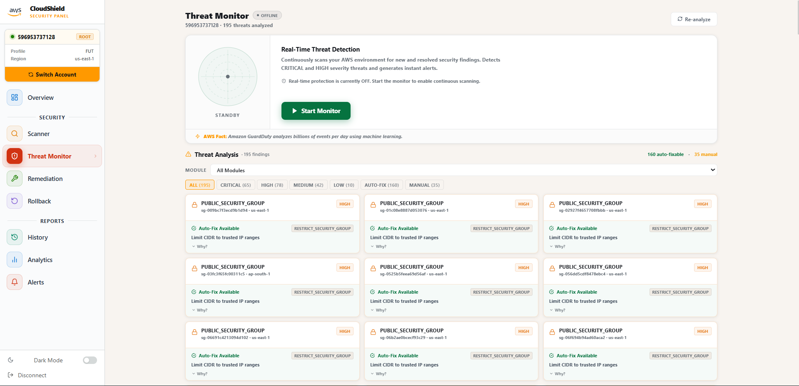
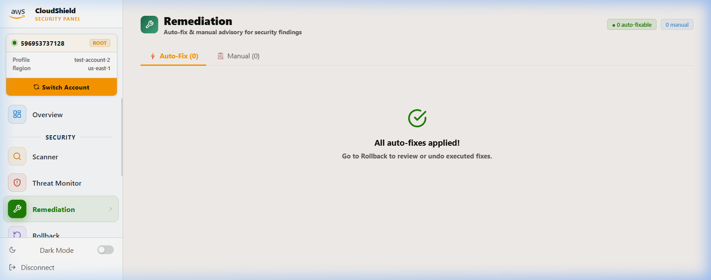

<div align="center">


# ☁️ AWS Cloud Control Panel

**Enterprise-grade AWS security scanner, threat monitor & auto-remediation platform**

[](https://python.org)
[](https://fastapi.tiangolo.com)
[](https://react.dev)
[](https://aws.amazon.com)
[](https://sqlite.org)
[](LICENSE)

*Scan · Detect · Remediate · Monitor — all from one beautiful panel*

</div>

---

## 📸 Screenshots

### Welcome & Account Selection

> System health dashboard, AWS region coverage, security module overview, and multi-account switching

### Command Center — Overview

> Real-time risk score, finding severity breakdown, recent security events, and quick action shortcuts

### Security Scanner — 176 Findings

> Full scan results with filters by severity, module, and region — all findings ranked and actionable

### Threat Monitor — Live Analysis

> 146 auto-fixable findings, 30 manual advisories — searchable by module, severity, and remediation type

### Auto-Remediation Pipeline

> Dry-run preview → approve → apply fix to AWS. Full rollback support for every executed action

---

## ✨ Features

### 🔍 Security Scanner
- **52+ security checks** across IAM, S3, EC2, VPC, RDS, KMS, CloudTrail, CloudWatch, and more
- **9 AWS regions** scanned concurrently with parallel per-region sub-scanners
- Fully parallelized S3 (per-bucket) and IAM (per-user) checks for **~20–30s scan time**
- Real-time progress log with module-specific status messages
- Findings ranked by severity: `CRITICAL` → `HIGH` → `MEDIUM` → `LOW`

### 🛡️ Threat Monitor
- Real-time continuous monitoring mode (live polling)
- Filterable by module, severity, and remediation type (AUTO-FIX / MANUAL)
- WebSocket-based instant alert delivery
- System tray notifications (Windows)

### ⚡ Auto-Remediation Engine
- **Dry-run preview** before any change is applied to AWS
- One-click apply with danger guard for irreversible actions
- Full **rollback** support — revert any executed fix from the Rollback section
- Manual advisory panel for findings requiring human review

### 📊 Dashboard & Analytics
- Risk Score engine (0–100) with CRITICAL/HIGH/MEDIUM/LOW categorisation
- Scan history with per-scan finding breakdowns
- Compliance posture tracking across time
- Alerts & notifications system with localStorage persistence

### 🔐 Multi-Account Support
- Add unlimited AWS accounts (Root or IAM user credentials)
- Switch accounts without re-entering credentials
- Per-account scan isolation and history

---

## 🏗️ Architecture

```
┌─────────────────────────────────────────────────────────┐
│                  React / Vite Frontend                   │
│   WelcomePage → PanelPage (Overview, Scanner, Threats,   │
│   Remediation, Rollback, History, Analytics, Alerts)     │
│   ScanContext · AuthContext · ToastSystem · Sidebar      │
└───────────────────────┬─────────────────────────────────┘
                        │ REST API + WebSocket
┌───────────────────────▼─────────────────────────────────┐
│              FastAPI Backend (port 8000)                  │
│   /api/scan  /api/execute  /api/rollback  /api/alerts    │
│   /api/history  /api/accounts  /api/monitor              │
└───┬───────────────┬───────────────┬─────────────────────┘
    │               │               │
┌───▼───┐     ┌─────▼────┐   ┌─────▼──────────────────┐
│Scanner│     │Remediation│   │   Threat Monitor        │
│Engine │     │ Executor  │   │   (FastWatcher/Polling) │
│9 mods │     │ Planner   │   │   WebSocket broadcaster │
└───┬───┘     │ Rollback  │   └────────────────────────┘
    │         └─────┬─────┘
┌───▼─────────────▼──────────────────────────────────────┐
│         boto3 / botocore  (AWS SDK)                      │
│         SQLite  (findings, executions, accounts, history)│
└─────────────────────────────────────────────────────────┘
```

---

## 🔬 Security Modules

| Module | Checks | Key Findings Detected |
|--------|--------|-----------------------|
| **IAM** | 12 | Admin users, wildcard policies, MFA missing, unused keys, key rotation |
| **S3** | 5 | Public ACLs, encryption disabled, versioning off, public access block |
| **EC2** | 6 | IMDSv2 disabled, public IPs, default SGs, termination protection |
| **VPC** | 5 | Flow logs disabled, default VPC, internet gateway, public subnets |
| **Security Groups** | 4 | Open SSH/RDP, unrestricted ingress, unused groups, NACL misconfig |
| **CloudTrail** | 3 | Logging disabled, no encryption, S3 bucket exposed |
| **CloudWatch** | 2 | Log group retention, metric filters |
| **KMS** | 2 | Key rotation disabled, CMK exposure |
| **RDS** | 3 | Public access, deletion protection, backup disabled |

---

## 🚀 Getting Started

### Prerequisites

| Requirement | Version |
|-------------|---------|
| Python | 3.11+ |
| Node.js | 18+ |
| AWS Account | Root or IAM credentials |

### Installation

```bash
# 1. Clone the repository
git clone https://github.com/NSudeep-Rust/CloudSecurityPanel.git
cd CloudSecurityPanel

# 2. Create and activate Python virtual environment
python -m venv venv
venv\Scripts\activate        # Windows
# source venv/bin/activate   # Linux/macOS

# 3. Install Python dependencies
pip install -r requirements.txt

# 4. Install frontend dependencies and build
cd app/ui
npm install
npm run build
cd ../..

# 5. Start the application
python run.py
```

The app will be available at **http://localhost:8000**

### First Run

1. Open `http://localhost:8000` in your browser
2. Click **"Add New Account"**
3. Enter your AWS credentials (Access Key ID + Secret Access Key)
4. Select your primary region
5. Click **"Run Scan"** — results in ~20–30 seconds

---

## 📁 Project Structure

```
CloudSecurityPanel/
├── app/
│   ├── api/
│   │   ├── main.py              # FastAPI app entry
│   │   └── routes/              # All API endpoints
│   ├── core/
│   │   └── aws_session.py       # boto3 session manager
│   ├── modules/
│   │   ├── scanner/             # 9 scanner engines
│   │   │   ├── scanner.py       # Main orchestrator
│   │   │   ├── iam_extra_scanner.py
│   │   │   ├── s3_scanner.py
│   │   │   ├── ec2_scanner.py
│   │   │   ├── rds_scanner.py
│   │   │   └── ...
│   │   ├── remediation/
│   │   │   ├── executor.py      # Applies fixes to AWS
│   │   │   ├── planner.py       # Dry-run preview
│   │   │   └── rollback.py      # Reverts executed fixes
│   │   ├── iam_manager/
│   │   │   └── iam_manager.py   # IAM-specific audits
│   │   └── threat_monitor/      # Live monitoring engine
│   ├── database/
│   │   └── models.py            # SQLAlchemy ORM models
│   ├── config/
│   │   └── security_config.py   # Severity mappings
│   └── ui/
│       └── src/
│           ├── pages/
│           │   ├── WelcomePage.jsx
│           │   ├── PanelPage.jsx
│           │   └── sections/    # All panel sections
│           ├── context/
│           │   ├── AuthContext.jsx
│           │   └── ScanContext.jsx
│           └── components/
│               ├── Sidebar.jsx
│               └── ToastSystem.jsx
├── run.py                       # Application entry point
└── requirements.txt
```

---

## 🛠️ Tech Stack

| Layer | Technology |
|-------|-----------|
| **Backend** | FastAPI (Python 3.11) |
| **AWS SDK** | boto3 + botocore |
| **Database** | SQLite via SQLAlchemy |
| **Frontend** | React 18 + Vite 5 |
| **Styling** | Vanilla CSS (no Tailwind) |
| **API Docs** | OpenAPI 3.1 (auto-generated) |
| **Auth** | JWT + bcrypt |
| **Notifications** | winotify (Windows) |
| **Real-time** | WebSocket (FastAPI) |

---

## 🔮 Roadmap

- [ ] **Windows Installer** — `CloudShield-Setup.exe` (PyInstaller + Electron + Inno Setup)
- [ ] **System Tray** — Minimize to tray, McAfee/Avast-style background operation
- [ ] **Auto-Updater** — Push code updates via GitHub Releases (no reinstall)
- [ ] **Linux Package** — `.AppImage` and `.deb` builds
- [ ] **Email Report Viewer** — Browser-accessible scan reports (no localhost required)
- [ ] **Scheduled Scans** — Cron-based automated scanning
- [ ] **Multi-Region Dashboard** — Per-region finding heatmap
- [ ] **Compliance Reports** — CIS AWS Benchmark, NIST export

---

## 🤝 Contributing

This project is currently **private**. Contribution guidelines will be published before public release.

---

## 📄 License

MIT License — see [LICENSE](LICENSE) for details.

---

<div align="center">
Built with ❤️ for AWS security professionals<br/>
<strong>AWS Cloud Control Panel</strong> — Scan. Detect. Remediate.
</div>
